# Official Supla Binding

<sub><sup>_This binding was tested with ZAMEL 
[ROW-01](http://www.zamel.pl/produkty/supla-sterowanie-wifi/supla--odbiorniki-dopuszkowe/row01) and 
[ROW-02](http://www.zamel.pl/produkty/supla-sterowanie-wifi/supla--odbiorniki-dopuszkowe/row02) devices. Big thanks 
to **Zamel** for providing free testing devices._</sup></sub>

Building automation systems available on the market are usually very complex, closed and expensive. In many cases they 
must be installed on the very early stages of house construction. SUPLA is simple, open and free of charge. It gives an 
opportunity to build elements based on RaspberryPI, Arduino or ESP8266 platforms and then join them either through LAN 
or WiFi. Through SUPLA you can, among others, control the lighting, switch on and off household appliances and media, 
open and shut gates and doors, or control room temperature. All the above can be done with just touch of a finger. SUPLA 
is available from any place on Earth if you just have a smartphone or tables available as well as Internet access. SUPLA 
is developed based on an Open Software and Open Hardware . This way, you can also develop this project! - [supla.org](https://www.supla.org/en/) 

# Supla Cloud

SUPLA-CLOUD is a central point joining the executive devices for indirect and direct operation of your household or 
office appliances and other elements with client applications which you can install on your tablets and smartphones. 
This software allows to operate, from one spot, the whole system infrastructure using any modern Internet browser. Server 
access is free of charge. You can also set up your own independent server working within the Internet or home network 
using system sources which you can download from GITHUB. - [supla.org](https://www.supla.org/en/) 

## Generating Token

First login to your [Supla Cloud](https://cloud.supla.org/), click `Integrations` and add new token (select all toggles).


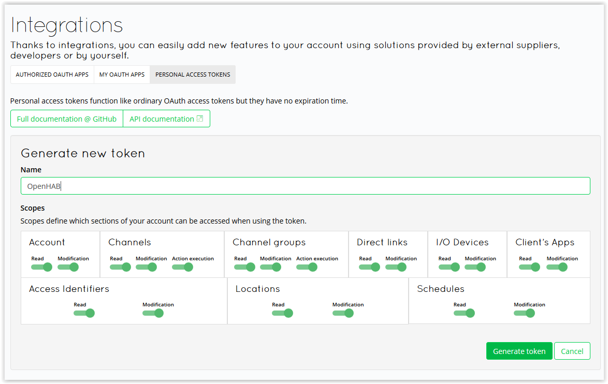
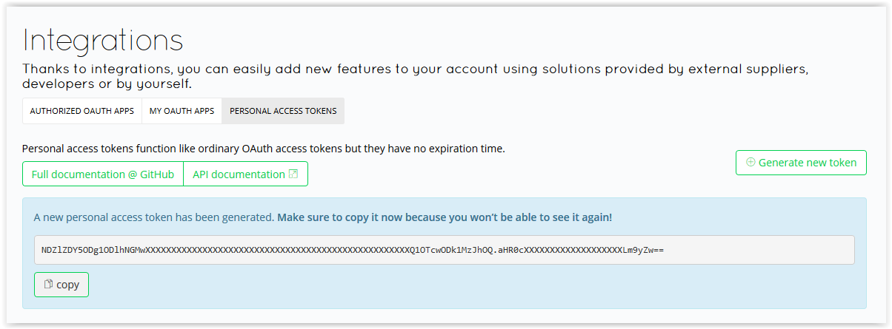

## Adding 

Go to `Configuration` > `Things` and add **manually** `Supla Cloud`. 


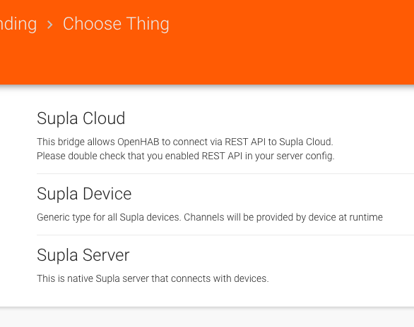

After this you can go to `Inbox` and discovery your devices that are added to Supla Cloud.

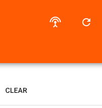
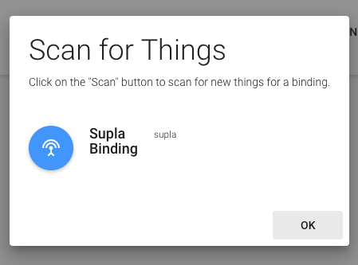
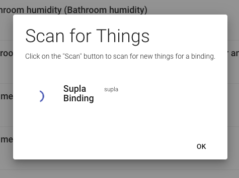

## (Not) Supported Things

Supported things:

* Switches & lights
* RGB and dimmer controllers
* Temperature & humidity devices
* Gates (and sensors)
* Roller shutter controllers

Not supported things:
* Meters

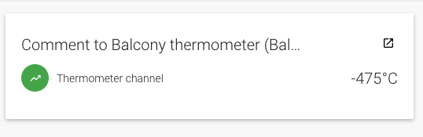
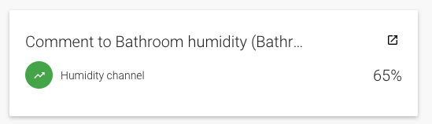

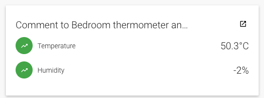
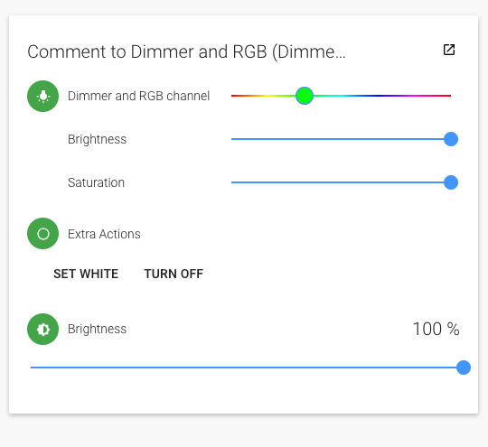
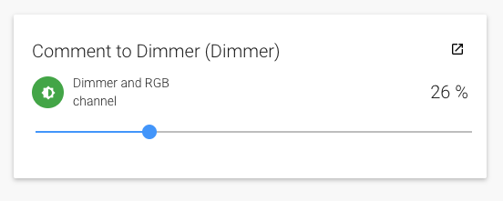
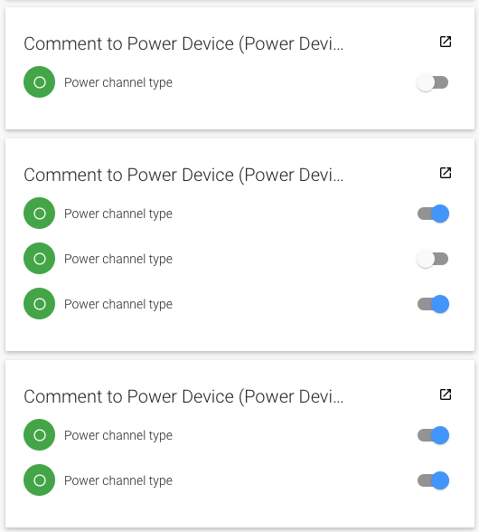
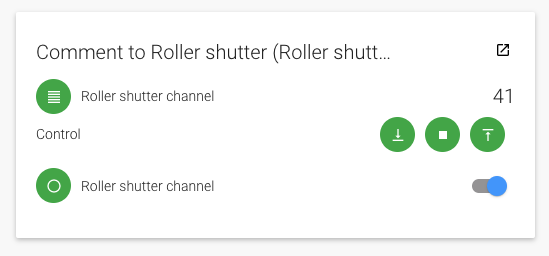
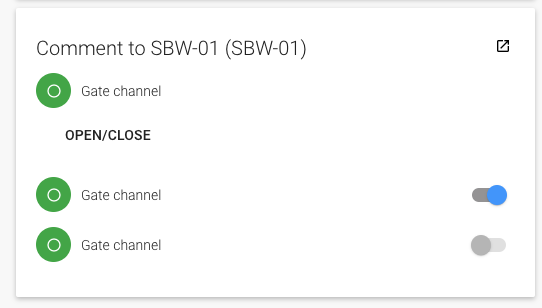
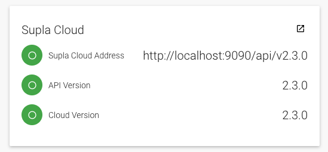

# Native Supla Server

Native Supla server is a way to create own Supla server. This is another way to hva local server without docker.  

## Discovery

Using auto discovery is recommended way of adding devices and server. After creating Supla server from inbox all 
devices will be added into the openHAB inbox page.

## Full Example

### Add Supla Server

After adding Supla binding go to inbox and add _Supla Server_. By default it will work on port ```2016```.

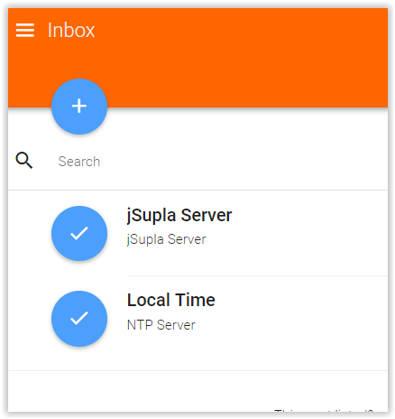

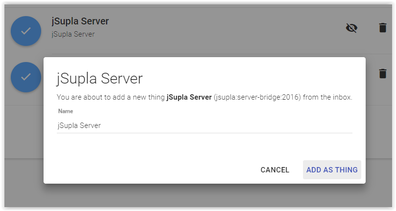
 
On configuration page you need to choose ```Server Access ID``` and ```Server Access ID Password```. Write this things down 
because you will need them later to configure your devices.
 
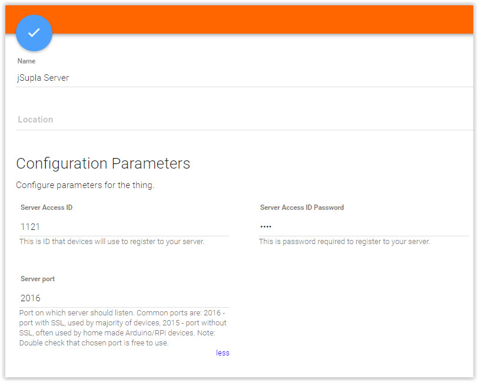
 
### Configure Supla devices

To configure device follow instructions provided by manufacturer. 

```Location ID``` and ```Location Password``` should be filled up with values from ```Server Access ID``` and 
```Server Access ID Password```.

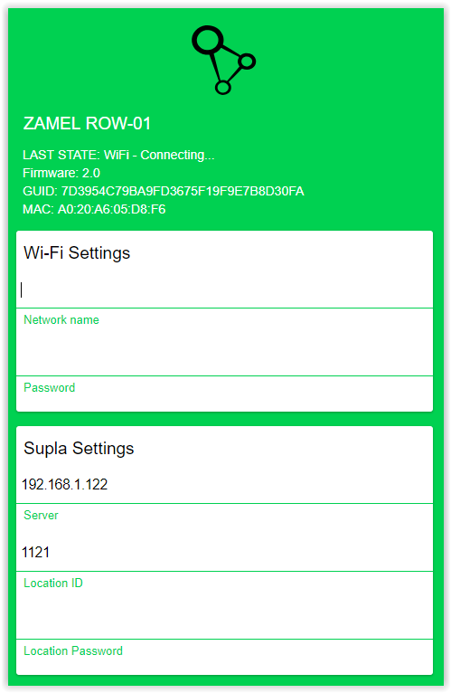

After restarting device wait up to 30 sec. and check OpenHAB inbox. You should find there a thing that has the same 
_GUID_ as device you configured. 

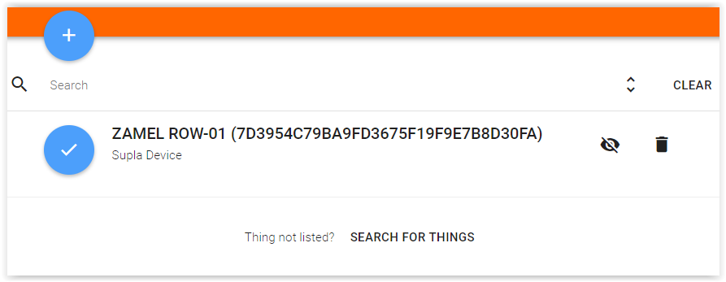

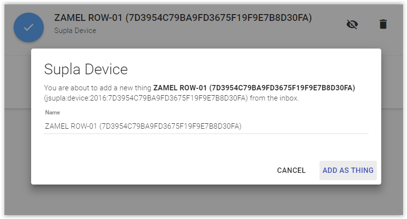

Last thing to do is open previously added thing and link channels by clicking o them. 

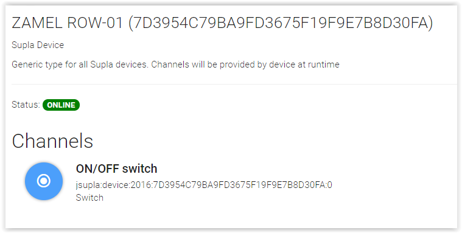

# Bugs, problems, ect.

If you find any bugs you can submit them [on Github issue page](https://github.com/SUPLA/openhab2-addons/issues). Before
doing this it would be great if you would provide details logs. To do this add this lines in `org.ops4j.pax.logging.cfg` 
(you should find this file in `userdata/etc` or `/var/lib/openhab2/etc`):

```
log4j2.logger.supla1.name = org.openhab.binding.supla
log4j2.logger.supla1.level = TRACE
log4j2.logger.supla1.additivity = true
log4j2.logger.supla1.appenderRefs = supla
log4j2.logger.supla1.appenderRef.supla.ref = SUPLA

log4j2.logger.supla2.name = pl.grzeslowski
log4j2.logger.supla2.level = TRACE
log4j2.logger.supla2.additivity = true
log4j2.logger.supla2.appenderRefs = supla
log4j2.logger.supla2.appenderRef.supla.ref = SUPLA

# Supla appender
log4j2.appender.supla.name = SUPLA
log4j2.appender.supla.type = RollingRandomAccessFile
log4j2.appender.supla.fileName = ${openhab.logdir}/supla.log
log4j2.appender.supla.filePattern = ${openhab.logdir}/supla.log.%i
log4j2.appender.supla.immediateFlush = true
log4j2.appender.supla.append = true
log4j2.appender.supla.layout.type = PatternLayout
log4j2.appender.supla.layout.pattern = %d{yyyy-MM-dd HH:mm:ss.SSS} [%-5.5p] [%-36.36c] - %m%n
log4j2.appender.supla.policies.type = Policies
log4j2.appender.supla.policies.size.type = SizeBasedTriggeringPolicy
log4j2.appender.supla.policies.size.size = 10MB
log4j2.appender.supla.strategy.type = DefaultRolloverStrategy
log4j2.appender.supla.strategy.max = 10
```

The log file should be in the same directory as  `org.ops4j.pax.logging.cfg` and named `supla.log`.

# Links

* [supla.org](http://www.supla.org) - link to official page
* [forum.supla.org](https://forum.supla.org/) - official forum page
* [e-sklep.zamel.pl](https://e-sklep.zamel.pl/kategoria-produktu/supla/) - shop where you can buy certified Supla devices
* [origin repo with this binding](https://github.com/SUPLA/openhab2-addons/)
* Person responsible for creating this binding [Martin Grześlowski](https://github.com/magx2)
